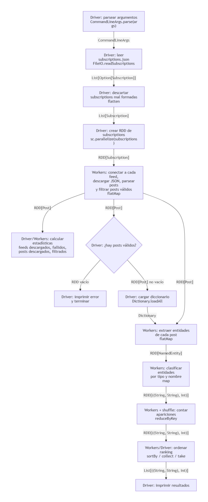

# Informe — Laboratorio 3

## Ejercicio 1 — Identificar las regiones paralelizables

### 1.a — Diagrama de flujo del pipeline

La idea del diagrama es mostrar los pasos del programa como un grafo de dependencias. Cada nodo representa una operación que realiza el driver o los workers, y cada flecha indica el tipo de dato que sale de un paso y entra al siguiente.



En el diagrama se ve que al principio el trabajo lo hace el driver: parsea argumentos, lee el archivo de suscripciones, descarta las suscripciones mal formadas y crea el `RDD[Subscription]`. A partir de ahí, Spark puede repartir el trabajo entre workers.

Después, los workers pueden descargar feeds, parsear posts y filtrar posts válidos. El resultado de esa etapa es un `RDD[Post]`. Con esos posts se pueden calcular estadísticas, verificar si quedó algún post válido y seguir con la extracción de entidades.

Luego se carga el diccionario en el driver y se usa junto con el `RDD[Post]` para extraer entidades. De ahí sale un `RDD[NamedEntity]`. Después cada entidad se transforma en una clave con su tipo y nombre, se cuentan las apariciones con `reduceByKey`, se ordena el ranking y finalmente el driver imprime los resultados.

Tipos principales del flujo:

```scala
CommandLineArgs
List[Option[Subscription]]
List[Subscription]
RDD[Subscription]
RDD[Post]
Dictionary
RDD[NamedEntity]
RDD[((String, String), Int)]
List[((String, String), Int)]
```

### 1.b — Abstracciones de Spark para cada paso

La idea es ver cada paso del pipeline y pensar si se puede aplicar paralelización con Spark o no. No importa tanto si el código actual ya está paralelizado, sino si ese paso se podría hacer usando `map`, `flatMap`, `reduceByKey` u otra operación de Spark.

#### `FileIO.readSubscriptions(cmdArgs.subscriptionFile)`

Para mí este paso no se podría paralelizar con Spark, ya que no tiene ninguna de esas operaciones. Además nos damos cuenta porque toma un `String`, que es el path del archivo, y no un conjunto de elementos. Por lo tanto no tendría sentido repartirlo entre workers.

Este paso lo hace el driver y devuelve algo como:

```scala
List[Option[Subscription]]
```

#### `val subscriptions = subscriptionOpts.flatten`

Esto tampoco haría falta hacerlo con Spark. Lo único que hace es agarrar la lista de suscripciones que pueden ser `Some` o `None`, sacar las que están mal y quedarse con las válidas.

Pasa de:

```scala
List[Option[Subscription]]
```

a:

```scala
List[Subscription]
```

Todavía estamos en el driver, antes de crear el RDD.

#### `sc.parallelize(subscriptions)`

Este paso no sería `map` ni `flatMap`, pero es importante porque acá recién convertimos la lista común en algo que Spark puede repartir.

Pasa de:

```scala
List[Subscription]
```

a:

```scala
RDD[Subscription]
```

A partir de acá sí se puede empezar a trabajar con varios workers.

#### Descargar feeds y parsear posts

Este paso sí se puede paralelizar, porque agarramos muchas `subscriptions` y cada una tiene su propia URL. Entonces se podría descargar más de un feed a la vez.

La idea es que cada worker agarre una `subscription`, saque su URL, descargue el JSON del feed y lo convierta en una lista de posts.

Para mí corresponde `flatMap`, porque una subscription puede devolver muchos posts, uno solo o ninguno si falla.

Sería algo así:

```scala
RDD[Subscription] => RDD[Post]
```

#### Contar feeds exitosos y fallidos

```scala
val feedsSuccess = downloadResults.count(_._1)
val feedsFailed = downloadResults.length - feedsSuccess
```

Esto se podría hacer con Spark, pero no es lo más importante de paralelizar porque contar es barato. Lo más pesado es descargar feeds, parsear JSON y extraer entidades.

Igual, si los datos ya están en un RDD, conviene calcularlo con Spark o con accumulators, para no traer todo al driver.

No sería `map` ni `flatMap`, sino más bien una acción o una métrica global.

#### Juntar todos los posts

```scala
val allPosts = downloadResults.flatMap(_._2)
```

Este paso sí puede ser `flatMap`, porque cada descarga tiene una lista de posts, y queremos juntar todas esas listas en una sola.

Pasa de algo como:

```scala
RDD[(Boolean, List[Post])]
```

a:

```scala
RDD[Post]
```

#### Contar posts descargados y fallidos

```scala
val postsSuccess = allPosts.length
val postsFailed = downloadResults.count(_._2.isEmpty)
```

Esto no sería `map` ni `flatMap`, porque no transforma cada elemento en otro. Lo que hace es calcular un número total.

Se puede hacer con una acción como `count()` o con accumulators.

#### Filtrar posts vacíos

```scala
val filteredPosts = Analyzer.filterEmptyPosts(allPosts)
```

Este paso sí se puede paralelizar, porque para saber si un post sirve o no, solo tengo que mirar ese post. No necesito mirar los demás.

Entonces cada worker puede filtrar los posts que le tocaron.

Esto corresponde a `filter`.

Pasa de:

```scala
RDD[Post]
```

a:

```scala
RDD[Post]
```

#### Contar posts filtrados

```scala
val postsFiltered = allPosts.length - filteredPosts.length
```

Esto también es una métrica global. Se puede calcular con `count()` antes y después del filtro, o usando un accumulator cuando se descarta un post.

No es `map` ni `flatMap`.

#### Calcular largo promedio de los posts

```scala
val totalChars = filteredPosts.map(post => post.title.length + post.selftext.length).sum
val avgChars = if (filteredPosts.nonEmpty) totalChars / filteredPosts.length else 0
```

La primera parte sí sería `map`, porque cada post produce exactamente un número: la cantidad de caracteres entre el título y el texto.

Después, para sumar todos esos números, hace falta una reducción o acción global.

Entonces sería:

```scala
RDD[Post] => RDD[Int]
```

con `map`, y después una suma para obtener el total.

#### Armar e imprimir estadísticas

```scala
val stats = Map(...)
println(Formatters.formatProcessingStats(stats))
```

Esto no hace falta paralelizarlo. Ya son datos chicos y finales. Lo hace el driver.

#### Verificar si no hay posts válidos

```scala
if (filteredPosts.isEmpty) {
  println("Error: No valid posts downloaded after filtering")
  return
}
```

Esto tampoco es `map` ni `flatMap`. Es una acción para saber si quedó algún post válido o no. Lo usa el driver para decidir si el programa sigue o termina.

#### Cargar diccionario

```scala
val dictionary = Dictionary.loadAll(cmdArgs.entitiesDir)
```

Esto no corresponde a Spark. Recibe el path del directorio de entidades y carga el diccionario. Lo hace el driver.

Después ese diccionario se usa para detectar entidades en los posts.

#### Extraer entidades

```scala
val allEntities = filteredPosts.flatMap { post =>
  val combinedText = post.title + " " + post.selftext
  Analyzer.detectEntities(combinedText, dictionary)
}
```

Este paso sí se puede paralelizar. Cada post se puede analizar por separado, y un post puede tener cero, una o muchas entidades.

Por eso corresponde `flatMap`.

Pasa de:

```scala
RDD[Post]
```

a:

```scala
RDD[NamedEntity]
```

#### Clasificar entidades

Para clasificar entidades, cada entidad se transforma en una clave con su tipo y nombre.

Por ejemplo:

```scala
entity => ((tipo, nombre), 1)
```

Esto corresponde a `map`, porque cada entidad produce exactamente un resultado.

Pasa de:

```scala
RDD[NamedEntity]
```

a:

```scala
RDD[((String, String), Int)]
```

#### Contar entidades

Este paso sí necesita juntar información de todos los workers, porque una misma entidad puede aparecer en distintos posts.

Entonces corresponde usar `reduceByKey`, por ejemplo:

```scala
reduceByKey(_ + _)
```

Esto suma todas las apariciones de la misma entidad.

Es una barrera de sincronización, porque Spark tiene que agrupar por clave y combinar resultados.

#### Contar entidades por tipo

Esto también se puede hacer con `map` y `reduceByKey`.

Primero cada entidad se transforma en:

```scala
(tipo, 1)
```

y después se suman las apariciones de cada tipo.

#### Ranking / ordenar resultados

El ranking se puede hacer ordenando los conteos por cantidad de apariciones. Esto sería con algo como `sortBy`.

Después, para imprimir, el driver toma los resultados con una acción como `take` o `collect`.

#### Resumen

En resumen, los pasos que más sentido tienen para paralelizar son descargar feeds, filtrar posts, extraer entidades y contar entidades. Los primeros pasos, como leer el archivo y hacer `flatten`, quedan en el driver. Los conteos globales y el ranking se pueden hacer con Spark, pero requieren juntar resultados de varios workers.

### Pasos que no encajan en `map`, `flatMap` o `reduceByKey`

Hay algunos pasos del pipeline que no encajan naturalmente en `map`, `flatMap` o `reduceByKey`.

Por ejemplo, `FileIO.readSubscriptions(cmdArgs.subscriptionFile)` no encaja porque recibe un solo `String`, que es el path del archivo, y no una colección de elementos independientes. Por eso se ejecuta en el driver.

También `subscriptionOpts.flatten` no hace falta llevarlo a Spark, porque todavía estamos trabajando con una lista local de suscripciones en el driver.

La carga del diccionario con `Dictionary.loadAll(cmdArgs.entitiesDir)` tampoco encaja como transformación distribuida, porque recibe un path y construye una estructura auxiliar que después se usa para analizar los posts.

Además, imprimir resultados o armar el `Map` de estadísticas tampoco corresponde a `map`, `flatMap` ni `reduceByKey`, porque son pasos finales que se hacen en el driver con datos ya agregados.

Algunos conteos, como contar feeds exitosos o posts descargados, tampoco son `map` ni `flatMap`, porque producen un único valor global. En Spark se pueden expresar como acciones, por ejemplo `count()`, o usando accumulators.

### 1.c — Barreras de sincronización

No todos los pasos del pipeline son iguales. Algunos se pueden ejecutar de forma completamente independiente en cada worker, y otros necesitan juntar información de todos los workers.

Los pasos independientes son:

- Descargar feeds: cada `Subscription` tiene su propia URL, entonces un worker puede descargar un feed sin depender de los demás.
- Parsear posts: cada JSON descargado se puede parsear por separado.
- Filtrar posts vacíos: para saber si un post sirve o no, solo hace falta mirar ese post.
- Extraer entidades: cada post se analiza independientemente.
- Clasificar entidades: cada entidad se transforma en una clave `(tipo, nombre)` sin depender de las otras.

Estos pasos no necesitan esperar el resultado de todos los workers para poder avanzar con cada elemento.

En cambio, los pasos que son barreras de sincronización son los conteos globales y el ranking.

El caso más claro es `reduceByKey`, usado para contar entidades. Una misma entidad puede aparecer en posts distintos y esos posts pueden haber sido procesados por workers distintos. Entonces Spark necesita agrupar todas las apariciones de la misma clave y sumarlas. En ese punto hay una barrera, porque el resultado final de una entidad depende de todos los workers.

También hay barrera cuando se calculan estadísticas globales como `count()`, porque el driver necesita recibir los conteos parciales de los workers para obtener un único número final.

El ranking también necesita comparar los conteos finales, por lo que ocurre después de haber combinado los resultados.

### 1.d — Restricciones sobre las funciones que se pasan a Spark

En Spark, el desarrollador no controla directamente los workers. Lo que hacemos es pasar funciones a operaciones como `map`, `flatMap` o `reduceByKey`, y Spark se encarga de ejecutarlas distribuídamente.

Por eso esas funciones tienen algunas restricciones.

Primero, tienen que poder serializarse, porque Spark necesita mandarlas desde el driver hacia los workers. Si una función depende de un objeto que no se puede serializar, puede fallar cuando Spark intente distribuir el trabajo.

Segundo, no conviene que dependan de estado compartido mutable. Por ejemplo, no estaría bien modificar una variable común desde varios workers esperando que el driver vea esos cambios, porque cada worker puede tener su propia copia y además se rompe la idea de procesamiento distribuido.

Tercero, hay que tener cuidado con los efectos secundarios, como hacer `println`, escribir archivos o modificar variables externas. En modo local puede parecer que funciona, pero en modo distribuido esos efectos ocurren en los workers y no necesariamente se ven de la forma esperada en el driver.

También conviene que las funciones sean determinísticas, es decir, que para el mismo input produzcan el mismo output. Esto es importante porque Spark puede reintentar tareas si alguna falla.

En el caso de `reduceByKey`, la función de reducción debería ser asociativa y conmutativa. Por ejemplo, la suma `_ + _` sirve porque da lo mismo el orden en que Spark combine los valores. Esto es necesario porque en un entorno distribuido Spark puede combinar resultados parciales en distinto orden.
